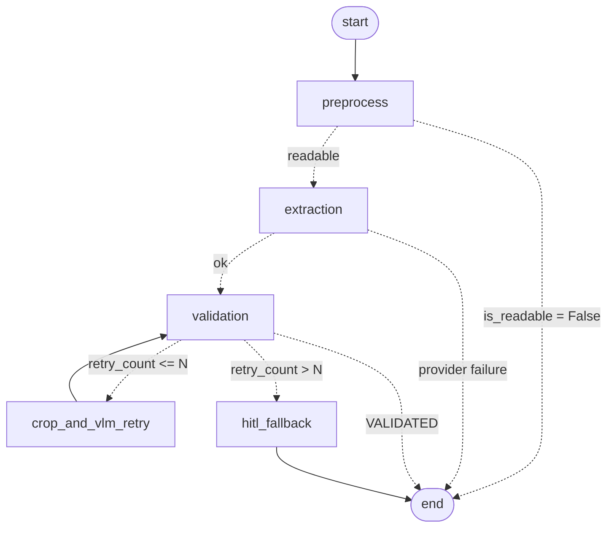

# ImageExtractor

A modular, provider agnostic OCR system: **LangGraph** for orchestration,
**Hexagonal Architecture (Ports & Adapters)** for decoupling, **OpenCV / PIL**
for preprocessing, **Pydantic** for the data contracts.

The workflow extracts a document, validates it with deterministic tools, and when
a field fails validation it crops that exact region and asks a Vision Language
Model to re-read it. Only when the retry budget is exhausted does it escalate to
a human operator.

---

## 1. Architecture

```
+---------------------------------------------------------------------+
|  graph/        nodes.py . workflow.py                               |
|  (application) orchestrates the ports, holds no business rule       |
+----------------+--------------------------------+-------------------+
                 | uses                           | calls
                 v                                v
+--------------------------------+  +--------------------------------+
|  domain/      (the core)       |<-|  ports/     (the contracts)    |
|  models . state . policy       |  |  DocumentExtractorPort  (ABC)  |
|  validation_tools . preprocess |  |  VLMProviderPort        (ABC)  |
+--------------------------------+  +----------------^---------------+
                                                      | implemented by
+----------------------------------------------------+----------------+
|  infrastructure/                                                    |
|  adapters/extractors: Azure . AWS Textract . Google DocAI . Native  |
|  adapters/vlm:        OpenAI . Anthropic . Ollama (Qwen2.5-VL)      |
|  config.py:           composition root, picks adapters from .env    |
+---------------------------------------------------------------------+
```

Dependencies point **inwards**, and `tests/test_architecture.py` enforces it by
parsing the source:

* `domain/` and `ports/` import no provider SDK, no infrastructure module, and
  not even LangGraph.
* `graph/` imports the domain and the ports only. The nodes receive a
  `WorkflowPolicy` (a plain domain dataclass), never the environment backed
  `Settings`.
* `infrastructure/config.py` is the single composition root that decides which
  concrete adapter is injected. `compile_workflow()` reaches into it through a
  deliberate function local import, which is the one composition seam.

### Directory layout

```text
src/
├── domain/
│   ├── models/             # Pydantic schemas (IDCardSchema, InvoiceSchema, ...)
│   ├── state.py            # TypedDict state for LangGraph
│   ├── policy.py           # WorkflowPolicy: retry budget + preprocessing knobs
│   ├── validation_tools.py # Regex and business rule validators
│   └── preprocessing.py    # OpenCV / PIL (EXIF, Laplacian, CLAHE, ROI crop)
├── ports/
│   ├── extractor_port.py   # ABC DocumentExtractorPort
│   └── vlm_port.py         # ABC VLMProviderPort
├── infrastructure/
│   ├── adapters/
│   │   ├── extractors/     # Azure, AWS, Google, NativeVLM adapters
│   │   └── vlm/            # OpenAI, Anthropic, Ollama adapters + prompts
│   └── config.py           # Environment variables & factory pattern
└── graph/
    ├── nodes.py            # Graph nodes (accepting injected ports)
    └── workflow.py         # StateGraph construction and compilation
```

---

## 2. The workflow



| Node | Responsibility |
| --- | --- |
| **0. `preprocess`** | EXIF transpose, Laplacian blur measurement with a fail fast abort, unsharp masking, CLAHE in LAB space, resize to 2000 px, JPEG at 85%. |
| **1. `extraction`** | Calls `DocumentExtractorPort.extract_document()`, parses the payload with the Pydantic schema bound to the document type, stores values and normalized bounding boxes. |
| **2. `validation`** | Runs the regex tools and the business rule tools. Sets `VALIDATED`, or records the errors and increments `retry_count`. |
| **3. `crop_and_vlm_retry`** | Crops each failing field (10% padding), magnifies it, and calls `VLMProviderPort.analyze_roi_crop()` with the validation error as context. Routes back to validation. |
| **4. `hitl_fallback`** | Flags the unresolved fields and calls LangGraph `interrupt()`, suspending the run in the checkpointer until an operator resumes it. |

### Design decisions worth knowing

* **Fail fast on blur.** Laplacian variance below `BLUR_CRITICAL_THRESHOLD / 2`
  aborts the run *before* any billable API call. Variance is measured on a copy
  normalized to a fixed width, so one threshold works for phone photos and
  flatbed scans alike.
* **Two images are kept.** `image_bytes` is the enhanced, downscaled payload sent
  to the provider; `original_image_bytes` is the EXIF corrected full resolution
  original. ROI crops come from the original, because the retry only pays off
  when the crop is genuinely magnified. Normalized bounding boxes make both
  interchangeable.
* **Crops are PNG, pages are JPEG.** JPEG ringing around thin strokes is exactly
  the artifact that makes a re-read fail twice.
* **The retry counter lives in the validation node**, not the retry node, so the
  budget stays correct even when a failing field cannot be located and the retry
  node is skipped.
* **`UNREADABLE` is terminal per field.** A field the model has declared
  illegible is never retried again; it goes straight to human review.
* **Operators are validated too.** A resumed correction is re-run through the
  same tools that rejected the automated extraction, so a bad value cannot be
  waved through.
* **Raw text, not typed values.** Adapters prefer the literal printed text over
  the provider's normalized value, because reformatted dates and amounts would
  defeat the regex validators.

---

## 3. Quick start

```bash
pip install -r requirements.txt
```

```bash
cp .env.example .env
```

Then run a document:

```bash
python main.py --image ./samples/invoice.jpg --doc-type Invoice
```

If the workflow escalates, it prints the review payload and exits with code `2`:

```bash
python main.py --resume doc-a1b2c3d4e5f6 --approve --correct total_amount=1432.09
```

Exit codes: `0` validated, `1` not validated, `2` waiting for a human.

---

## 4. Switching providers

Only two environment variables decide the entire infrastructure:

```bash
EXTRACTOR_PROVIDER=azure   # azure | aws | google | native_vlm
VLM_PROVIDER=anthropic     # openai | anthropic | ollama
```

Every adapter imports its SDK lazily, so an unused provider does not need to be
installed. A fully on-premise deployment looks like this:

```bash
EXTRACTOR_PROVIDER=native_vlm
VLM_PROVIDER=ollama
OLLAMA_MODEL=qwen2.5vl:7b
```

### Using the system as a library

```python
from src.graph.workflow import compile_workflow, run_document
from src.infrastructure.config import build_dependencies

dependencies = build_dependencies()
workflow = compile_workflow(dependencies)

final_state = run_document(
    workflow,
    image_bytes=open("invoice.jpg", "rb").read(),
    doc_type="Invoice",
    thread_id="invoice-2026-001",
)
print(final_state["status"], final_state["extracted_data"])
```

Ports can also be injected directly, which is how the tests run the whole graph
with no credentials at all:

```python
dependencies = build_dependencies(extractor=MyFakeExtractor(), vlm_provider=MyFakeVLM())
```

---

## 5. Prompt templates

Both templates live in `src/infrastructure/adapters/vlm/prompts.py`, so every
provider is asked exactly the same question and an A/B comparison measures the
model rather than the prompt.

* **A. Primary extraction** (native VLM adapter): instructs the model to return
  only JSON matching the requested schema and to emit `null` rather than guess.
  Bounding box grounding is opt-in via `NATIVE_VLM_REQUEST_BOUNDING_BOXES`.
* **B. Targeted ROI retry**: re-reads a single field from a magnified crop,
  given the exact validation error, and must answer with the bare value or
  `UNREADABLE`.

Model answers are sanitized before use: code fences, surrounding quotes and
conversational prefixes are stripped, so one chatty model does not break the
contract for everyone.

---

## 6. Adding a new document type

Everything lives in the domain layer; no adapter and no node changes.

1. Add the Pydantic schema in `src/domain/models/`, declaring `ALIASES` for the
   provider vocabularies.
2. Register it in `SCHEMA_REGISTRY` in `src/domain/models/__init__.py`.
3. Register its field rules and business rules in
   `src/domain/validation_tools.py`.
4. Map the document type to a provider model id (Azure `prebuilt-*`, a Google
   processor id) through configuration.

---

## 7. Tests

```bash
python -m pytest
```

123 tests cover the preprocessing chain, the validation tools, the adapter
mapping logic, the architecture rules, and the whole graph end to end (happy
path, fail fast rejection, ROI repair, retry budget enforcement, `UNREADABLE`
short circuit, human review resume, and provider outage). No credential or
network access is required: the suite injects fakes through the ports, which is
the practical payoff of the port abstraction.

---

## 8. Production notes

* **Checkpointer.** `compile_workflow()` defaults to an in memory saver, which
  loses suspended runs the moment the process exits — fine for a library call
  that runs and resumes in the same process, but not for the CLI, where
  `--image` and `--resume` are necessarily separate invocations. `main.py`
  therefore passes an explicit `SqliteSaver` backed by `checkpoints.sqlite3`
  (created next to `main.py`, already gitignored), so a run that escalates to
  human review can be resumed from a later invocation, or after a restart.
  Multi-instance deployments need a server backed saver instead:

  ```python
  from langgraph.checkpoint.postgres import PostgresSaver
  workflow = compile_workflow(dependencies, checkpointer=PostgresSaver.from_conn_string(dsn))
  ```

* **Transient errors.** Adapters wrap SDK failures in `ExtractionError` /
  `VLMProviderError` and do not retry the network call themselves. Configure
  retries in the SDK client (`max_retries` on the OpenAI and Anthropic clients,
  a botocore `Config` retry policy) rather than in the graph, whose retry budget
  is about OCR quality, not connectivity.
* **PII.** Identity documents are held in memory only; nothing is written to
  disk. Set `LOG_LEVEL=WARNING` in production, since `INFO` logs the value a ROI
  re-read returned.
* **Cost.** The fail fast filter, the single call extraction and the field
  scoped retries are all there to keep the per document cost bounded. The
  `retry_count` and `blur_variance` state keys are the two metrics worth
  exporting first.
