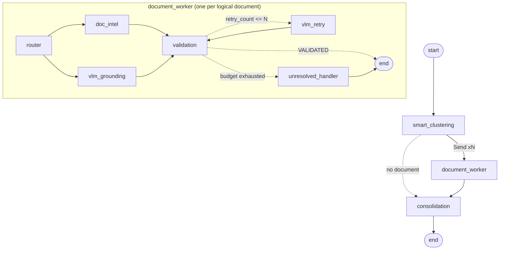

# ImageExtractor

A modular, provider agnostic OCR system: **LangGraph** for orchestration,
**Hexagonal Architecture (Ports & Adapters)** for decoupling, **OpenCV / PIL**
for preprocessing, **Pydantic** for the data contracts.

Two workflows share one composition root:

* **Single document** — extracts a document, validates it with deterministic
  tools, and when a field fails validation crops that exact region and asks a
  Vision Language Model to re-read it. When the retry budget is exhausted it
  escalates to a human operator through LangGraph `interrupt()`.
* **Dossier** — takes one multi-document PDF, splits it into logical documents,
  and processes them **in parallel** through a Map-Reduce fan-out. It is
  strictly **headless**: it never suspends, and a document it cannot validate is
  reported as `REQUIRES_MANUAL_ENTRY` rather than blocking the run.

---

## 1. Architecture

```
+---------------------------------------------------------------------+
|  graph/     orchestrator.py . worker_graph.py . edges.py            |
|             workflow.py . nodes/                                    |
|  (application) orchestrates the ports, holds no business rule       |
+----------------+--------------------------------+-------------------+
                 | uses                           | calls
                 v                                v
+--------------------------------+  +--------------------------------+
|  domain/      (the core)       |<-|  ports/     (the contracts)    |
|  models . state . policy       |  |  DocumentExtractorPort  (ABC)  |
|  orchestrator_state            |  |  VLMProviderPort        (ABC)  |
|  worker_state                  |  |  PDFProcessorPort       (ABC)  |
|  validation_tools . preprocess |  |                                |
+--------------------------------+  +----------------^---------------+
                                                      | implemented by
+----------------------------------------------------+----------------+
|  infrastructure/                                                    |
|  adapters/extractors: Azure . AWS Textract . Google DocAI . Native  |
|  adapters/vlm:        OpenAI . Anthropic . Ollama . AI Foundry      |
|  adapters/processors: PyMuPDF (300 DPI rasterization)               |
|  config.py:           composition root, picks adapters from .env    |
+---------------------------------------------------------------------+
```

Dependencies point **inwards**, and `tests/test_architecture.py` enforces it by
parsing the source:

* `domain/` and `ports/` import no provider SDK, no infrastructure module, and
  not even LangGraph.
* `graph/` imports the domain and the ports only. The nodes receive a
  `WorkflowPolicy` (a plain domain dataclass), never the environment backed
  `Settings`.
* `infrastructure/config.py` is the single composition root that decides which
  concrete adapter is injected. `compile_workflow()` reaches into it through a
  deliberate function local import, which is the one composition seam.

### Directory layout

```text
src/
├── domain/
│   ├── models/             # Pydantic schemas (IDCardSchema, InvoiceSchema, ...)
│   ├── state.py            # Single document state
│   ├── orchestrator_state.py # Dossier state + BoundingBox2D + output contract
│   ├── worker_state.py     # Per-document worker state
│   ├── policy.py           # WorkflowPolicy: retry budget, routing table, knobs
│   ├── validation_tools.py # Regex and business rule validators
│   └── preprocessing.py    # OpenCV / PIL (EXIF, Laplacian, CLAHE, ROI crop)
├── ports/
│   ├── extractor_port.py   # ABC DocumentExtractorPort
│   ├── vlm_port.py         # ABC VLMProviderPort
│   └── pdf_port.py         # ABC PDFProcessorPort
├── infrastructure/
│   ├── adapters/
│   │   ├── extractors/     # Azure, AWS, Google, NativeVLM adapters
│   │   ├── processors/     # PyMuPDF adapter
│   │   └── vlm/            # OpenAI, Anthropic, Ollama, AI Foundry + prompts
│   └── config.py           # Environment variables & factory pattern
└── graph/
    ├── nodes/              # Graph nodes (accepting injected ports)
    ├── edges.py            # Dynamic Send fan-out
    ├── workflow.py         # Single document graph
    ├── worker_graph.py     # Per-document worker subgraph
    └── orchestrator.py     # Dossier Map-Reduce graph
```

---

## 2. The single document workflow


| Node | Responsibility |
| --- | --- |
| **0. `preprocess`** | EXIF transpose, Laplacian blur measurement with a fail fast abort, unsharp masking, CLAHE in LAB space, resize to 2000 px, JPEG at 85%. |
| **1. `extraction`** | Calls `DocumentExtractorPort.extract_document()`, parses the payload with the Pydantic schema bound to the document type, stores values and normalized bounding boxes. |
| **2. `validation`** | Runs the regex tools and the business rule tools. Sets `VALIDATED`, or records the errors and increments `retry_count`. |
| **3. `crop_and_vlm_retry`** | Crops each failing field (10% padding), magnifies it, and calls `VLMProviderPort.analyze_roi_crop()` with the validation error as context. Routes back to validation. |
| **4. `hitl_fallback`** | Flags the unresolved fields and calls LangGraph `interrupt()`, suspending the run in the checkpointer until an operator resumes it. |

### Design decisions worth knowing

* **Fail fast on blur.** Laplacian variance below `BLUR_CRITICAL_THRESHOLD / 2`
  aborts the run *before* any billable API call. Variance is measured on a copy
  normalized to a fixed width, so one threshold works for phone photos and
  flatbed scans alike.
* **Two images are kept.** `image_bytes` is the enhanced, downscaled payload sent
  to the provider; `original_image_bytes` is the EXIF corrected full resolution
  original. ROI crops come from the original, because the retry only pays off
  when the crop is genuinely magnified. Normalized bounding boxes make both
  interchangeable.
* **Crops are PNG, pages are JPEG.** JPEG ringing around thin strokes is exactly
  the artifact that makes a re-read fail twice.
* **The retry counter lives in the validation node**, not the retry node, so the
  budget stays correct even when a failing field cannot be located and the retry
  node is skipped.
* **`UNREADABLE` is terminal per field.** A field the model has declared
  illegible is never retried again; it goes straight to human review.
* **Operators are validated too.** A resumed correction is re-run through the
  same tools that rejected the automated extraction, so a bad value cannot be
  waved through.
* **Raw text, not typed values.** Adapters prefer the literal printed text over
  the provider's normalized value, because reformatted dates and amounts would
  defeat the regex validators.

---

## 3. The dossier engine (multi-document, headless)

One PDF in, many documents out, processed in parallel.



| Node | Responsibility |
| --- | --- |
| **1. `smart_clustering`** | Rasterizes every page at 300 DPI, classifies each one from a low resolution copy, then groups them into *logical* documents. |
| **2. `edges.dispatch_documents`** | Emits one `Send` per logical document, so the number of parallel workers is decided at runtime. |
| **3. `router`** | Records which extraction branch the document takes, from a table on `WorkflowPolicy`. |
| **4A. `doc_intel`** | Template based extraction (identity documents), across every page of the document. |
| **4B. `vlm_grounding`** | Visual grounding extraction: field values *and* normalized boxes, in one pass over all pages. |
| **5. `validation`** | The same deterministic tools the single document workflow runs. |
| **6. `vlm_retry`** | Crops the failing field, magnifies it 2.5×, denoises, equalizes and sharpens it, then asks for a targeted re-read. |
| **7. `unresolved_handler`** | **Headless terminal state.** Keeps the dirty text, records each unresolved field with its reason and box, reports `REQUIRES_MANUAL_ENTRY`. |
| **8. `consolidation`** | Fan-in: derives the dossier verdict from every worker result. |

### Design decisions worth knowing

* **Non-contiguous pages are paired.** A front page claims the first still
  unclaimed matching back page *anywhere later in the dossier*, so an INE
  photocopied on pages 1 and 3 with a utility bill in between is reassembled into
  a single `INE_COMBINED` document. A naive splitter that assumes a document ends
  where the next begins gets this wrong, and it is the most common dossier shape
  in practice.
* **Classification runs on a shrunk copy.** Identifying a page is a layout
  question, not a transcription one; sending the 300 DPI raster would multiply
  the token bill of the most frequent call in a run without changing the answer.
  A cheaper model (`gpt-4o-mini`) serves it too.
* **Multi page documents are read in one call.** A field printed only on the back
  of a card can then be reconciled with the name printed only on the front. Two
  independent calls would produce two half filled documents nothing can merge
  reliably.
* **The dirty text is never discarded.** A value that failed a format check is
  still the best evidence of what is printed, and an operator would rather edit a
  near miss than retype the field.
* **One bad document does not sink the dossier.** A crashing worker returns a
  `FAILED` document; every sibling still completes.
* **No `interrupt()`, anywhere.** `tests/test_architecture.py` parses the dossier
  modules and fails the build if one appears, so the headless guarantee is
  enforced rather than documented.

### The master output contract

```json
{
  "dossier_id": "DOSSIER_2026_99482",
  "dossier_status": "REQUIRES_REVIEW",
  "total_documents_processed": 2,
  "documents": [
    {
      "doc_id": "DOSSIER_2026_99482_INVOICE_2",
      "doc_type": "INVOICE",
      "status": "REQUIRES_MANUAL_ENTRY",
      "extracted_data": { "issuer_rfc": "ABC123456T12", "total_amount": "$1,160.SO" },
      "successful_fields": ["issuer_rfc"],
      "unresolved_fields": [
        {
          "field_name": "total_amount",
          "error_reason": "Value contains non-numeric characters for currency validation",
          "bounding_box": { "x_min": 0.7241, "y_min": 0.8512, "width": 0.1820, "height": 0.0315 }
        }
      ]
    }
  ]
}
```

`dossier_status` is `COMPLETED` when every document succeeded, `FAILED` when none
did, and `REQUIRES_REVIEW` otherwise: a dossier is only usable when every piece of
it is.

---

## 4. Quick start

```bash
pip install -r requirements.txt
```

```bash
cp .env.example .env
```

Then run a document:

```bash
python main.py --image ./samples/invoice.jpg --doc-type Invoice
```

If the workflow escalates, it prints the review payload and exits with code `2`:

```bash
python main.py --resume doc-a1b2c3d4e5f6 --approve --correct total_amount=1432.09
```

Exit codes: `0` validated, `1` not validated, `2` waiting for a human.

Or run a whole dossier, headlessly:

```bash
python main.py --dossier ./samples/kyc.pdf --id DOSSIER_2026_99482
```

It prints the master JSON contract and exits `0` when every document succeeded,
`1` otherwise. It never exits `2`: the dossier engine cannot suspend.

---

## 5. Switching providers

Two environment variables decide the entire infrastructure:

```bash
EXTRACTOR_PROVIDER=azure        # azure | aws | google | native_vlm
VLM_PROVIDER=azure_foundry      # openai | anthropic | ollama | azure_foundry
```

Every adapter imports its SDK lazily, so an unused provider does not need to be
installed. A fully on-premise deployment looks like this:

```bash
EXTRACTOR_PROVIDER=native_vlm
VLM_PROVIDER=ollama
OLLAMA_MODEL=qwen2.5vl:7b
```

### Secretless authentication on Azure

Leaving the key **empty** is the preferred enterprise configuration, not a
misconfiguration: it selects Microsoft Entra ID, and `DefaultAzureCredential`
resolves a Managed Identity on a deployed host, a workload identity in AKS, or
your `az login` session locally. No key is ever stored, rotated or leaked.

```bash
EXTRACTOR_PROVIDER=azure
VLM_PROVIDER=azure_foundry
AZURE_DOCUMENT_INTELLIGENCE_ENDPOINT=https://<resource>.cognitiveservices.azure.com/
AZURE_DOCUMENT_INTELLIGENCE_KEY=
AZURE_FOUNDRY_ENDPOINT=https://<resource>.openai.azure.com/
AZURE_FOUNDRY_DEPLOYMENT=gpt-4o
AZURE_FOUNDRY_CLASSIFIER_DEPLOYMENT=gpt-4o-mini
AZURE_FOUNDRY_API_KEY=
```

The identity needs the **Cognitive Services OpenAI User** role on the Foundry
resource and **Cognitive Services User** on the Document Intelligence one. Both
adapters log which authentication path they resolved, and warn when a key is used.

### Using the system as a library

```python
from src.graph.workflow import compile_workflow, run_document
from src.infrastructure.config import build_dependencies

dependencies = build_dependencies()
workflow = compile_workflow(dependencies)

final_state = run_document(
    workflow,
    image_bytes=open("invoice.jpg", "rb").read(),
    doc_type="Invoice",
    thread_id="invoice-2026-001",
)
print(final_state["status"], final_state["extracted_data"])
```

The dossier engine is the same shape:

```python
from src.graph.orchestrator import compile_dossier_workflow, run_dossier
from src.infrastructure.config import build_dependencies

dependencies = build_dependencies()
workflow = compile_dossier_workflow(dependencies)

report = run_dossier(
    workflow,
    pdf_bytes=open("kyc.pdf", "rb").read(),
    dossier_id="DOSSIER_2026_99482",
)
print(report.to_json_dict())
```

Ports can also be injected directly, which is how the tests run both graphs with
no credentials at all:

```python
dependencies = build_dependencies(
    extractor=MyFakeExtractor(),
    vlm_provider=MyFakeVLM(),
    pdf_processor=MyFakePDFProcessor(),
)
```

---

## 6. Prompt templates

All three templates live in `src/infrastructure/adapters/vlm/prompts.py`, so every
provider is asked exactly the same question and an A/B comparison measures the
model rather than the prompt.

* **A. Primary extraction / visual grounding**: instructs the model to return
  only JSON matching the requested schema and to emit `null` rather than guess.
  Bounding box grounding is opt-in via `NATIVE_VLM_REQUEST_BOUNDING_BOXES`, and
  always on for the dossier's grounding branch. Above one page, the prompt
  explicitly forbids the model's default reflex of answering once per image.
* **B. Targeted ROI retry**: re-reads a single field from a magnified crop,
  given the exact validation error, and must answer with the bare value or
  `UNREADABLE`.
* **C. Page classification**: assigns one label from a closed vocabulary to a
  single page of a dossier.

Model answers are sanitized before use: code fences, surrounding quotes and
conversational prefixes are stripped, so one chatty model does not break the
contract for everyone. A classifier that answers in a sentence still has its
label recovered.

---

## 7. Adding a new document type

Everything lives in the domain layer; no adapter and no node changes.

1. Add the Pydantic schema in `src/domain/models/`, declaring `ALIASES` for the
   provider vocabularies.
2. Register it in `SCHEMA_REGISTRY` in `src/domain/models/__init__.py`.
3. Register its field rules and business rules in
   `src/domain/validation_tools.py`.
4. Map the document type to a provider model id (Azure `prebuilt-*`, a Google
   processor id) through configuration.

For a type the dossier engine must also recognize, add it to `PageType` /
`LogicalDocType` in `src/domain/orchestrator_state.py` (the classifier prompt
builds its vocabulary from that enum) and give it a branch in
`DEFAULT_STRATEGY_BY_DOC_TYPE`, or override it through `STRATEGY_BY_DOC_TYPE`.

---

## 8. Tests

```bash
python -m pytest
```

265 tests cover the preprocessing chain, the validation tools, the adapter
mapping logic, the architecture rules, and both graphs end to end. No credential
or network access is required: the suite injects fakes through the ports, which
is the practical payoff of the port abstraction.

| Area | What is asserted |
| --- | --- |
| Single document graph | Happy path, fail fast rejection, ROI repair, retry budget, `UNREADABLE` short circuit, human review resume, provider outage. |
| Coordinate normalization | Azure 8-point polygons to normalized boxes, rotated scans, out-of-bounds clamping. |
| Semantic clustering | Interleaved front/back pairing, two cards not cross-pairing, orphan pages, unique document ids. |
| Router | Every document type reaches the right branch; the table is configurable. |
| Validation | Arithmetic and regex failures, proof of address rules, CURP cross checks. |
| Unresolved handler | Dirty text preserved, reasons and boxes recorded, `REQUIRES_MANUAL_ENTRY`, and no interrupt. |
| Dossier graph | Fan-out, the reduce channel, the master JSON contract, failure isolation. |
| Architecture | The dependency rule, and that no dossier module calls `interrupt()`. |

---

## 9. Production notes

* **Checkpointer.** `compile_workflow()` defaults to an in memory saver, which
  loses suspended runs the moment the process exits — fine for a library call
  that runs and resumes in the same process, but not for the CLI, where
  `--image` and `--resume` are necessarily separate invocations. `main.py`
  therefore passes an explicit `SqliteSaver` backed by `checkpoints.sqlite3`
  (created next to `main.py`, already gitignored), so a run that escalates to
  human review can be resumed from a later invocation, or after a restart.
  Multi-instance deployments need a server backed saver instead:

  ```python
  from langgraph.checkpoint.postgres import PostgresSaver
  workflow = compile_workflow(dependencies, checkpointer=PostgresSaver.from_conn_string(dsn))
  ```

  The dossier engine needs none of this: it is headless and never suspends, so
  `compile_dossier_workflow()` takes no checkpointer by default. Passing a
  durable one still buys resumption after a crash on a long dossier.

* **Parallelism.** The `Send` fan-out runs the workers concurrently in
  LangGraph's executor, so a ten document dossier costs roughly one document of
  wall clock time plus the clustering pass. Concurrency is therefore bounded by
  your provider's rate limit, not by this code; throttle at the SDK client if a
  large dossier trips a 429.
* **Transient errors.** Adapters wrap SDK failures in `ExtractionError`,
  `VLMProviderError` or `PDFProcessingError` and do not retry the network call
  themselves. Configure retries in the SDK client (`max_retries` on the OpenAI,
  Azure and Anthropic clients, a botocore `Config` retry policy) rather than in
  the graph, whose retry budget is about OCR quality, not connectivity.
* **PII.** Identity documents are held in memory only; nothing is written to
  disk, and the master report drops every image binary by construction. Set
  `LOG_LEVEL=WARNING` in production, since `INFO` logs the value a ROI re-read
  returned.
* **Cost.** The fail fast filter, the shrunk classification copy, the single call
  extraction and the field scoped retries are all there to keep the per document
  cost bounded. The `retry_count` and `blur_variance` state keys, and the count
  of documents ending in `REQUIRES_MANUAL_ENTRY`, are the metrics worth exporting
  first.
